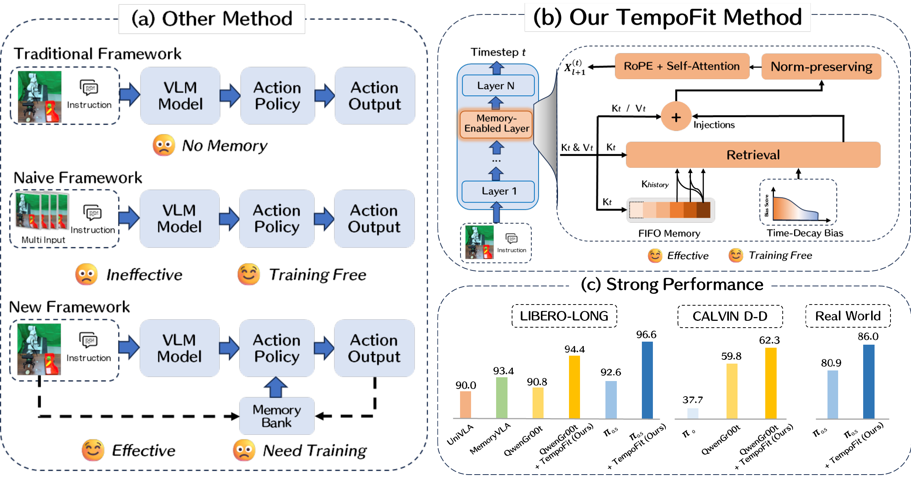
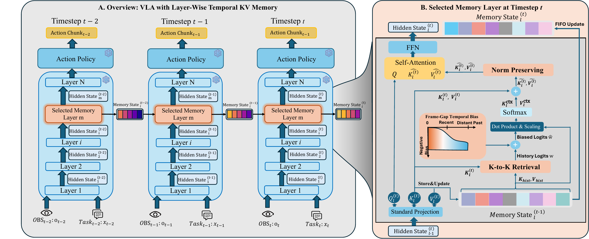
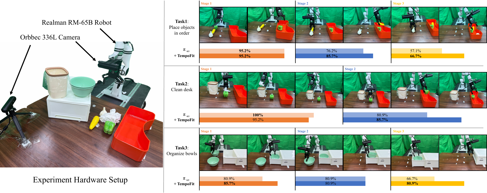

<div align="center">

# TempoFit

### Plug-and-Play Layer-Wise Temporal KV Memory for Long-Horizon Vision-Language-Action Manipulation

Jun Sun\*, Boyu Yang\*, Jiahao Zhang, Ning Ma, Chencheng Wu,<br>
Siqing Zhang, Yiou Huang, Qiufeng Wang, Shan Liang, Yaran Chen

Xi'an Jiaotong-Liverpool University<br>
<sup>\* Equal contribution</sup>

[**Paper**](https://arxiv.org/abs/2603.07647) | [**PDF**](https://arxiv.org/pdf/2603.07647) | [**Method**](#method) | [**Experiments**](#experiments) | [**Citation**](#citation)

**Temporal memory for frozen VLA policies, without additional training or extra input tokens.**

</div>

[](assets/pdf/overview.pdf)

> **Release status:** Paper figures and experimental summaries are available. Inference code, integration instructions, and evaluation scripts are coming soon. This repository does not yet contain a runnable implementation.

## Introduction

Vision-Language-Action (VLA) policies often make decisions from the current observation alone. In long-horizon manipulation, occlusion, visually similar states, and subtle post-action changes can make that observation insufficient: a robot may repeat a completed operation, miss a subtask, or lose continuity between stages.

Stacking historical frames adds visual tokens and computation, while learned temporal interfaces typically require additional training. **TempoFit instead reuses the backbone's own attention keys and values as temporal memory.** It caches prefix K/V at selected intermediate layers, retrieves relevant history, and loads it into the current K/V before self-attention. The pretrained backbone, action head, and input sequence length remain unchanged.

### Highlights

- **Training-free retrofit:** no additional trainable modules or weight updates to add temporal memory to an existing policy.
- **Layer-wise, KV-native memory:** a bounded FIFO cache stores model-native prefix states rather than historical image tokens.
- **Content and recency:** K-to-K retrieval with Frame-Gap Temporal Bias (FGTB) favors relevant history while suppressing stale context.
- **Measured gains:** LIBERO-LONG success improves from **92.6% to 96.6%** for pi0.5 and **90.8% to 94.4%** for QwenGR00T.
- **Small measured overhead:** at an 8-frame history, latency is **74.4 ms** versus **71.2 ms** for the single-frame pi0.5 baseline on an NVIDIA RTX 5090.

"Training-free" describes the TempoFit addition, not the original training or task adaptation of the underlying VLA. All results below are reported in [arXiv v1](https://arxiv.org/abs/2603.07647v1), not newly reproduced by this repository update.

## Method

[](assets/pdf/method.pdf)

1. **Cache prefix K/V.** Store projected prefix keys and values before rotary positional embeddings (RoPE), only at selected intermediate layers. Action/suffix tokens are not stored in this temporal memory.
2. **Retrieve with K-to-K matching.** Use current prefix keys to query historical keys in the frozen backbone's native key space, then read out both historical keys and values with the resulting weights.
3. **Apply FGTB.** Add a fixed, head-dependent penalty based on the timestep gap to reduce interference from stale history without learning a gate.
4. **Load and rescale.** Add the retrieved context to the current K/V and restore their original per-token norms before the subsequent attention computation. No historical tokens are appended to the input sequence.

For one memory-enabled layer and attention head, the retrieval operation is:

$$
W = \mathrm{softmax}\left(\frac{K_t K_{\mathrm{hist}}^\top}{\sqrt{d}} + \mathrm{Mask} + B_{\mathrm{FGTB}}\right),
\qquad K_{\mathrm{ctx}} = W K_{\mathrm{hist}},\quad V_{\mathrm{ctx}} = W V_{\mathrm{hist}}.
$$

FGTB uses $B_{\mathrm{FGTB}}(t,\tau)=-\beta m_h |t-\tau|\alpha_S$, with a fixed head-wise slope $m_h$ and default token-scale factor $\alpha_S=S$. Residual loading forms $\widetilde K_t=K_t+K_{\mathrm{ctx}}$ and $\widetilde V_t=V_t+V_{\mathrm{ctx}}$, followed by norm-preserving rescaling. See Section III of the [paper](https://arxiv.org/pdf/2603.07647v1) for the complete formulation.

## Experiments

### LIBERO-LONG

The paired comparisons evaluate **10 tasks with 50 trials per task (500 trials per configuration)** under a primary-camera and wrist-camera setup. The standard history capacity is **8 frames**. Checkpoints are taken from RLinf (pi0.5) and StarVLA (QwenGR00T).

| Frozen backbone | Baseline success | + TempoFit | Absolute gain |
| :--- | ---: | ---: | ---: |
| pi0.5 (RLinf) | 92.6% | **96.6%** | **+4.0 pp** |
| QwenGR00T (StarVLA) | 90.8% | **94.4%** | **+3.6 pp** |

Here, **pp** denotes percentage points. Averages above are the paper-reported values. On "Put both pots on stove," pi0.5 improves from **58.0% to 84.0%**. Gains are not uniform across every task; see [Detailed Experiments](docs/experiments.md#libero-long) for the paired task results, broader comparison, and a source-table aggregation discrepancy.

### CALVIN

CALVIN evaluates sequential execution of up to five language instructions. **D-D** trains and evaluates in environment D; **ABC-D** trains in A/B/C and evaluates in unseen environment D. Average length is the reported average number of completed tasks; five-task success is a percentage, not an average length.

| Setting | Backbone | Average length: baseline | + TempoFit | Five-task success: baseline | + TempoFit |
| :--- | :--- | ---: | ---: | ---: | ---: |
| D-D | QwenGR00T | 3.78 | **3.84** | 59.8% | **62.3%** |
| ABC-D | pi0.5 | 3.83 | **3.87** | 61.4% | **62.0%** |

See the [full 1-5 instruction results](docs/experiments.md#calvin) for the early- and late-stage breakdown.

### Inference Efficiency

Measurements below are from the paper's LIBERO-LONG evaluation on an **NVIDIA RTX 5090**, using the pi0.5 backbone. Latency and peak GPU memory are measured at each timestep and averaged over the episode.

| Configuration | History length | Latency (ms) | Peak memory (MB) |
| :--- | ---: | ---: | ---: |
| Single-frame pi0.5 | 1 | 71.2 | 6,396 |
| Multi-frame input | 4 | 94.8 | 22,640 |
| **TempoFit** | **4** | **73.4** | **6,498** |
| Multi-frame input | 8 | 176.3 | 45,980 |
| **TempoFit** | **8** | **74.4** | **6,600** |
| TempoFit | 16 | 81.4 | 6,761 |
| TempoFit | 32 | 86.8 | 7,030 |

An 8-frame TempoFit cache adds **3.2 ms** and **204 MB** relative to the single-frame baseline. These are hardware- and configuration-specific inference measurements, not training costs or an end-to-end robot control frequency guarantee.

### Ablations

Selected ablations use the pi0.5 backbone on LIBERO-LONG, with 500 trials per configuration.

| Configuration | Average success |
| :--- | ---: |
| Baseline, no temporal memory | 92.6% |
| KV memory only | 93.8% |
| Q-to-K retrieval instead of K-to-K | 93.3% |
| Residual loading without norm preservation | 90.2% |
| Memory at all layers (0-17) | 74.2% |
| **Full TempoFit** | **96.6%** |

The results favor selective intermediate-layer memory, K-to-K retrieval, recency bias, and norm preservation rather than adding history indiscriminately. See [all ablations](docs/experiments.md#ablations), including history capacity and concatenation.

### Real-World Manipulation

[](assets/pdf/real-world.pdf)

The real-robot setup uses a **Realman RM-65B**, an **Orbbec 336L** scene camera, and a wrist-mounted USB camera. The paper reports **100 demonstrations per task** and task-specific pi0.5 baseline training. TempoFit is proposed as a training-free addition; the complete real-world training and retrofit protocol is not specified.

| Task | Long-horizon sequence | Baseline final-stage success | + TempoFit |
| :--- | :--- | ---: | ---: |
| Place objects in order | Sequentially place three vegetables into a tray | 57.1% | **66.7%** |
| Clean desk | Dispose of tissue, then place a pepper into a box | 80.9% | **85.7%** |
| Organize bowls | Put both green bowls into a drawer and close it | 66.7% | **80.9%** |

Values above follow **Figure 3** as printed. The paper's real-world trial-count statement and rounded percentages are not fully consistent; see the [stage-wise results and reporting notes](docs/experiments.md#real-world-manipulation). No raw success counts are inferred here.

## Repository Contents

| Path | Contents |
| :--- | :--- |
| [`assets/figures/`](assets/figures/) | High-resolution PNG previews of the three paper figures |
| [`assets/pdf/`](assets/pdf/) | Original PDF figure assets |
| [`assets/README.md`](assets/README.md) | Figure index, provenance, and export details |
| [`docs/experiments.md`](docs/experiments.md) | Detailed result tables, evaluation context, and reporting notes |
| [`CITATION.cff`](CITATION.cff) | Machine-readable paper citation |

## Release Status

- [x] Paper available on arXiv
- [x] Paper figures and experimental documentation
- [ ] TempoFit inference implementation
- [ ] Backbone integration and installation instructions
- [ ] Evaluation scripts and reproducible configurations

## Citation

```bibtex
@article{sun2026tempofit,
  title={TempoFit: Plug-and-Play Layer-Wise Temporal KV Memory for Long-Horizon Vision-Language-Action Manipulation},
  author={Sun, Jun and Yang, Boyu and Zhang, Jiahao and Ma, Ning and Wu, Chencheng and Zhang, Siqing and Huang, Yiou and Wang, Qiufeng and Liang, Shan and Chen, Yaran},
  journal={arXiv preprint arXiv:2603.07647},
  year={2026},
  doi={10.48550/arXiv.2603.07647},
  url={https://arxiv.org/abs/2603.07647}
}
```

## Acknowledgments

Our evaluations build on [LIBERO](https://github.com/Lifelong-Robot-Learning/LIBERO), [CALVIN](https://github.com/mees/calvin), [OpenPI](https://github.com/Physical-Intelligence/openpi), [StarVLA](https://github.com/starVLA/starVLA), and [RLinf](https://github.com/RLinf/RLinf). We thank the authors and maintainers for their open research resources.
